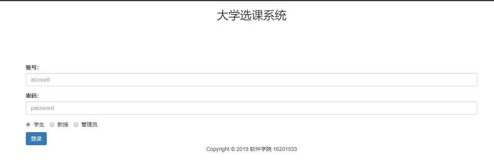
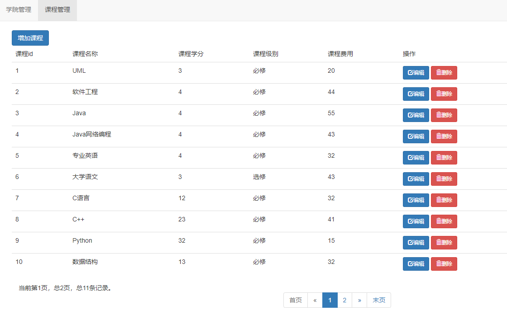
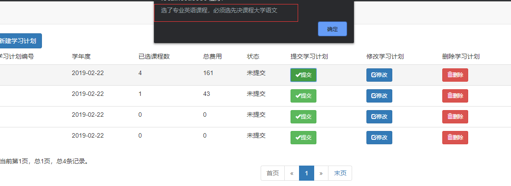
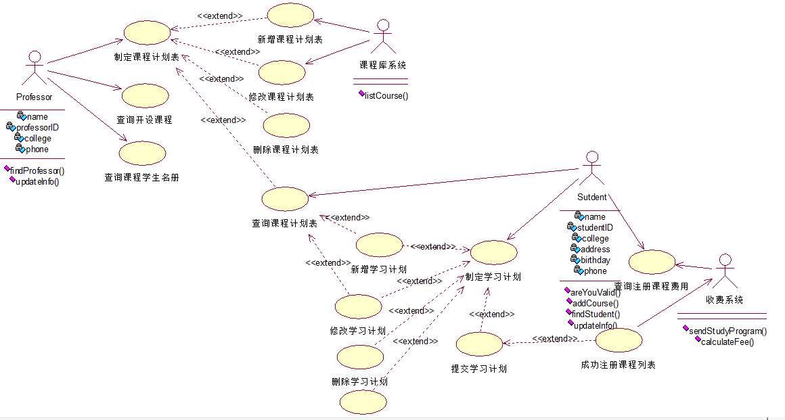

# 代码都是自己通过自学写出来的，学校根本不会教你怎么写，所以有很多地方代码会出现重复，在页面上修改某些字段可以修改别人的选课计划。

# selectCourse
# 大学选课系统
## 需求陈述如下
某个中等规模的大学为全8制的学生提供大量本科生学位,这个大学的教学机构由学院组成，每个学院包含几个专业方向。每个学院管理- .种学位，每种学位都有若干必修课和若干选修课，每门课程都处于一个给定的级别并且有一个学分值。同一门课程可以是若干学位的部分，一个学位还含有其他学院提供的课程。每种学位都要给定完成学位所要求的总学分值。

令该大学自豪的是,其给予了学生在选课时的自主权。选课的灵活性使得大学课程注册系统变得复杂。学生可以组合课程计划表所提供的课程,形成他们的学习计划(注册课程)，一方面适合他们的个人需要,另一方面完成了这些课程他们就能得到他们所注册的学位。个人选课的自主权不应该与学位管理的规则相矛盾，例如，学生必须学习过某门课程的先修课程，才能选修该门课程。学生对课程的选择可能受时间冲突、最大的班级人数等条件的限制。

在每个学期的开始，学生们会得到-份本学期将要开设的课程计划表。学生在一段时间内要确定他自己本学期打算上的课程，作为他的课程注册信息。允许学生选择四门主选课程和两门备选课程。每门课程最多有10名、最少有3名学生选择才能开课。少于3个人报名的课程将被取消。系统对于每个学生提交的课程注册信息，检查他们的前提条件、所选课程的已报名人数:时间表冲突等约束，将选课成功或失败的消息通知给学生。对于成功注册的课程，系统通过收费系统统计该学生的课程费用，以便学生缴费。选课时间段结東后，教授可以查询到他自己将要讲授的耶些课程以及这些课程中每门课程有哪些学生报名。

该大学提供的教育的灵活性,是学生数量增长的主要原因。然而,为了维护它的传统强项，当前的注册系统部分是手工的，必须由新的软件系统来代替。由于这个大学课程注册系统有自身的独特性，找不到合适的商品软件,因而只能自行开发。

登录界面

课程管理界面

学生提交选课计划不满足的提示信息

系统用例图如下

